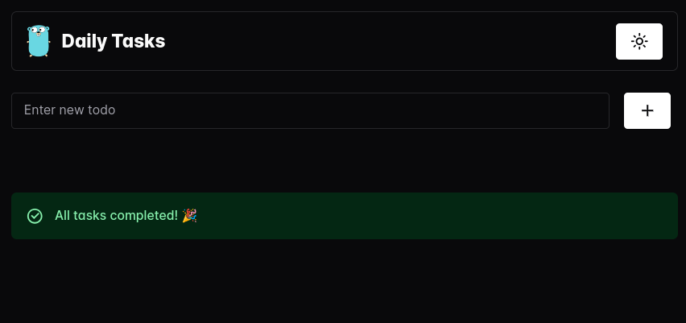

# GoDo

GoDo is a ToDo application built using GO Lang.

## Table of Contents

- [Introduction](#introduction)
- [Features](#features)
- [Contributing](#contributing)

## Introduction

This project is built using GO, React, TypeScript, and Vite.

## Features

- React + TypeScript + Vite setup
- Chakra UI components for styling and layout
- React Query for data fetching and caching
- MongoDB integration using Fiber and MongoDB Driver

## Contributing

Contributions are welcome! Please submit a pull request with a clear description of the changes.
